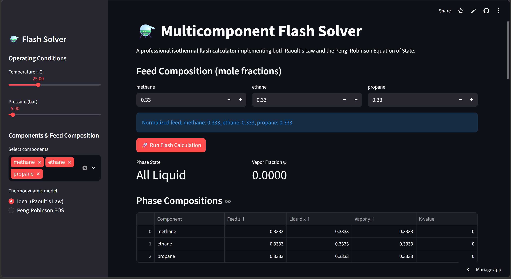
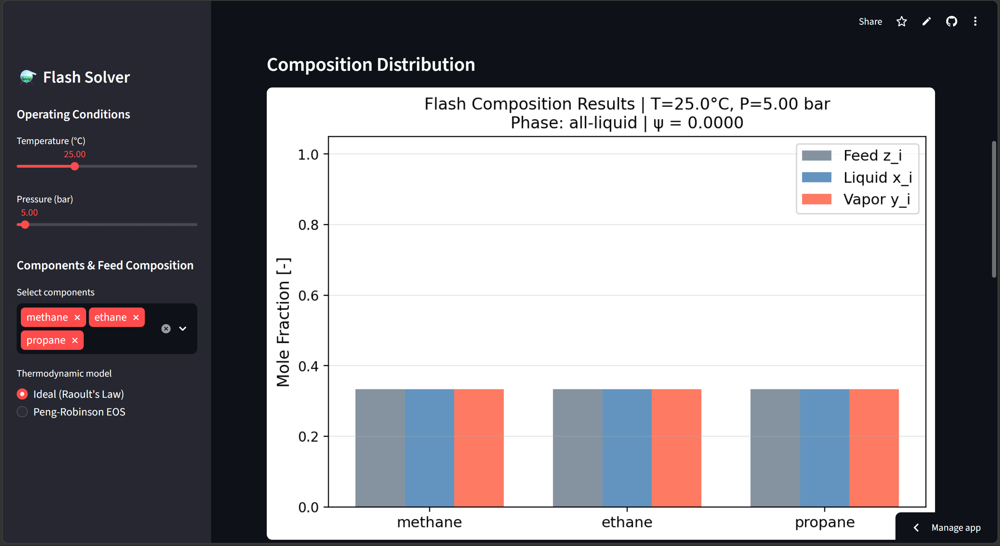
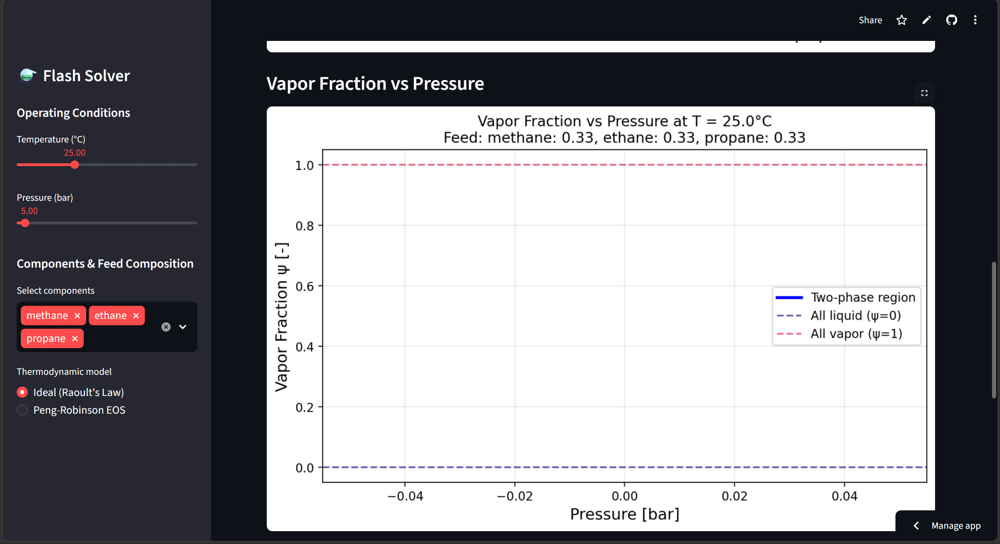

# ⚗️ Multicomponent Flash Solver


An **interactive Vapor–Liquid Equilibrium (VLE) flash calculation tool** for chemical engineering.

This project implements a **multicomponent isothermal flash solver** similar to the thermodynamic core used in **Aspen Plus / Aspen HYSYS**.

Users can compute:

- Vapor fraction (ψ)
- Liquid phase composition
- Vapor phase composition
- Equilibrium K-values

using either:

- **Raoult's Law (ideal thermodynamics)**
- **Peng–Robinson Equation of State (real thermodynamics)**

---

#  Live Web App

Try the interactive solver here:

**https://flash-solver-mbnzf7anbs3vj57k6cappmz.streamlit.app/**

The Streamlit app allows users to:

- adjust **temperature and pressure**
- select mixture **components**
- choose thermodynamic **models**
- visualize **phase compositions**

---

#  Demo

## Interface



---

## Phase Composition Results



---

## Vapor Fraction vs Pressure



---

# Theory

Flash calculations determine **phase equilibrium** for a mixture at a given **temperature (T)** and **pressure (P)**.

At equilibrium, the **fugacity of each component must be equal in both phases**:


fᵢᴸ = fᵢⱽ


This leads to the **equilibrium ratio (K-value)**:


Kᵢ = yᵢ / xᵢ


Where:

- **xᵢ** = liquid mole fraction  
- **yᵢ** = vapor mole fraction  

---

## Rachford–Rice Equation

The vapor fraction **ψ (psi)** is obtained by solving:


f(ψ) = Σ [ zᵢ (Kᵢ − 1) / (1 + ψ (Kᵢ − 1)) ] = 0


Where:

- **zᵢ** = feed mole fraction  
- **xᵢ** = liquid composition  
- **yᵢ** = vapor composition  

Physical interpretation of ψ:

| ψ value | Phase state |
|------|------|
| ψ = 0 | All liquid |
| ψ = 1 | All vapor |
| 0 < ψ < 1 | Two-phase equilibrium |

The solver uses **Brent's root-finding method** for robust convergence.

---

## Thermodynamic Models

### Ideal Model (Raoult's Law)


Kᵢ = P_sat,i / P


Used for:

- low pressure systems
- ideal mixtures
- educational demonstrations

---

### Peng–Robinson Equation of State


P = RT/(V − b) − a(T) / [ V(V + b) + b(V − b) ]


Used for:

- hydrocarbons
- high-pressure systems
- natural gas processing

Real K-values are computed from **fugacity coefficients**:


Kᵢ = φᵢᴸ / φᵢⱽ

---

#  Features

✔ Multicomponent flash calculation  
✔ Rachford–Rice vapor fraction solver  
✔ Raoult's Law thermodynamic model  
✔ Peng–Robinson EOS  
✔ Component thermodynamic database  
✔ Interactive Streamlit interface  
✔ Composition visualization plots  
✔ Vapor fraction sensitivity analysis  

---

#  Project Structure

```

flash-solver
│
├── data/
│   └── component_database.csv
│
├── flash/
│   ├── flash_calculation.py
│   └── rachford_rice.py
│
├── thermodynamics/
│   ├── antoine.py
│   ├── fugacity.py
│   ├── peng_robinson.py
│   └── raoults_law.py
│
├── visualization/
│   └── phase_diagrams.py
│
├── examples/
│   ├── methane_ethane_flash.py
│   └── natural_gas_flash.py
│
├── streamlit_app.py
├── main.py
├── requirements.txt
└── README.md

```

---

#  Installation

Clone the repository

```

git clone [https://github.com/Deepanshu-Sati/flash-solver.git](https://github.com/Deepanshu-Sati/flash-solver.git)
cd flash-solver

```

Install dependencies

```

pip install -r requirements.txt

```

---

#  Run Web App

```

streamlit run streamlit_app.py

```

Then open:

```

[http://localhost:8501](http://localhost:8501)

```

---

#  Command Line Example

```

python main.py 
--components methane ethane propane 
--feed 0.6 0.3 0.1 
--temperature 25 
--pressure 10 
--model pr

```

---

#  Example Studies

### Methane–Ethane Binary Flash

Demonstrates phase equilibrium behavior for light hydrocarbons.

### Natural Gas Flash Separator

Typical natural gas mixture:

| Component | Fraction |
|------|------|
| methane | 0.70 |
| ethane | 0.15 |
| propane | 0.08 |
| n-butane | 0.04 |
| n-pentane | 0.03 |

---

#  Validation

The solver was validated using:

- published VLE data
- NIST thermodynamic properties
- mass balance checks

Verification criteria:

| Test | Expected |
|----|----|
| Mass balance | Σx = Σy = 1 |
| Bubble point | ψ = 0 |
| Dew point | ψ = 1 |
| PR-EOS convergence | < 30 iterations |

---

#  Requirements

```

numpy
scipy
pandas
matplotlib
streamlit

```

---

#  Future Extensions

Possible research-level improvements:

- Phase envelope tracing
- PT flash calculations
- Three-phase flash (VLLE)
- Activity coefficient models (NRTL / Wilson)
- CoolProp integration
- GPU acceleration

---

#  Author

**Deepanshu Sati**  
Chemical Engineering  
National Institute of Technology Hamirpur

---

#  License

MIT License

---


